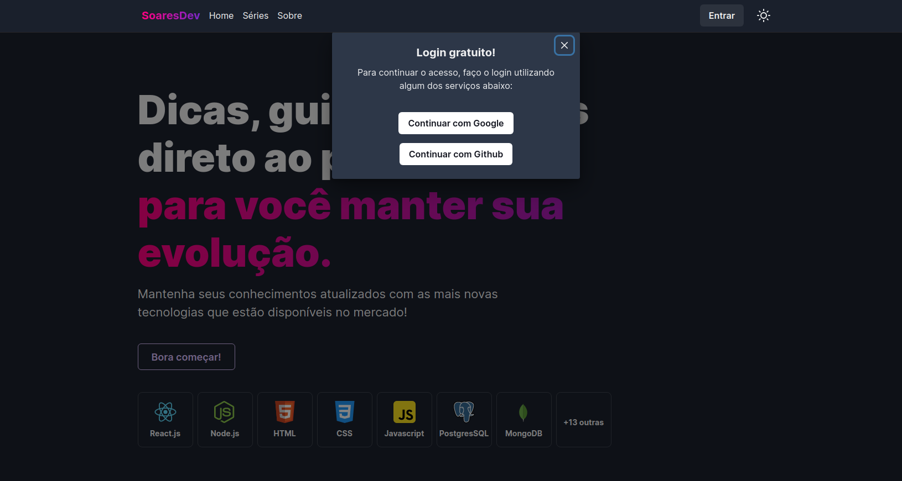

<p align="center">
  <a target="blank"></a>
</p>

[circleci-image]: https://img.shields.io/circleci/build/github/nestjs/nest/master?token=abc123def456
[circleci-url]: https://circleci.com/gh/nestjs/nest

<p align="center">
  

  

  

  
</p>

## Descrição

Um website com conteúdos para estudos de programação web, possui funções de um blog contendo posts gerenciados pelo [DatoCMS](https://www.datocms.com/), os dados são consumidos utilizando o [GrapQL](https://www.graphql.com/), e as rotas são protegidas por autenticação utilizando o sistema de autenticação do [firebase](https://firebase.google.com/), o projeto foi desenvolvido com a linguagem de programação Javascript e o Framework de React.js chamado [Next.js](https://nextjs.org/)

## Executar o projeto

```bash
# Clone o repositório
$ git clone https://github.com/jefferson1104/nextjs-website.git

# Abra o projeto no seu vscode

# Execute o projeto
$ yarn dev

# Rotas
/
/allseries
/about
/privacy

```

## Screenshots





